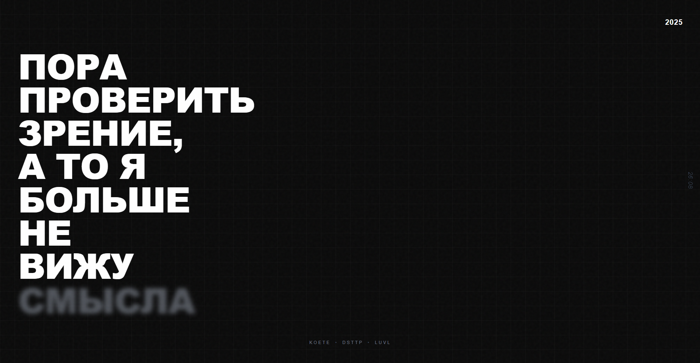

# ПОРА ПРОВЕРИТЬ ЗРЕНИЕ

Interactive art project by **koete**, **dsttp**, and **luvl**.



## Overview

A minimalist interactive experience exploring the theme of perception and meaning. Features mouse-tracking parallax effects, real-time elapsed time counter, and responsive design across all devices.

## Tech Stack

- Next.js 16 with App Router
- React 19
- TypeScript
- Tailwind CSS 4
- Static export

## Development

```bash
npm install
npm run dev
```

Open [http://localhost:3000](http://localhost:3000) to view the project.

## Build

```bash
npm run build
```
